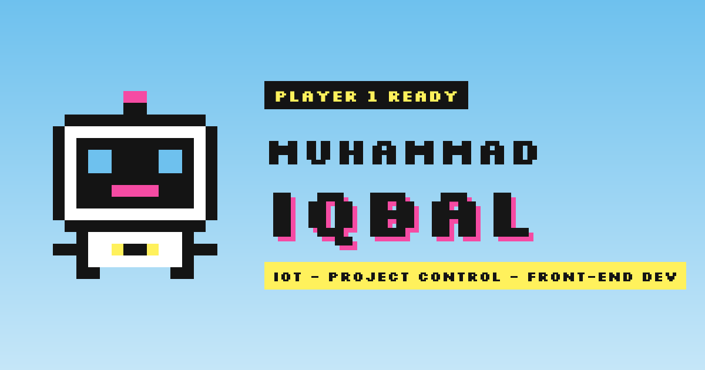

# Iqbal.exe: pixel portfolio



so i was just tinkering with next.js and stuff and here i am i wish to learn more with deploying more project
but here i am now, i think making a project portofolio would be a great start for my path in the tech industries lol,
but here it is my very own project portofolio with pixel design.

**Live site:** https://t4magoro.github.io

## Features

- **Game-style sections:** Player card (about + stats), Inventory (skills), Spellbook (programming languages),
  Quest log (experience + achievements), Badges (certificates), Save files (projects), Art corner and a
  "Continue?" contact screen.
- **Art gallery page** (`/art`) with a full-screen viewer: previous/next buttons, arrow keys, Esc to close.
- **Pixel art drawn in code:** every sprite, the robot, the clouds and the mountains are SVG built from
  text grids, so they stay sharp at any size.
- **Interactive touches:** the robot follows the mouse (or your taps on phones) and jumps when tapped,
  cards lift on hover or tap, stat bars fill up on scroll, and a small paint canvas to draw on.
- **Works everywhere:** mobile-friendly layout, respects "reduce motion", content stays visible even if
  JavaScript is slow or fails.
- **SEO ready:** sitemap, robots.txt, share preview image, and structured data (JSON-LD).

## Tech stack

| Area | Tools |
| --- | --- |
| Framework | [Next.js](https://nextjs.org) 16 (App Router), exported as a static site |
| UI | React 19, TypeScript 5 |
| Styling | Tailwind CSS 4, plain CSS for the pixel components |
| Animation | CSS animations and transitions, [Motion](https://motion.dev) for springs |
| Fonts | Silkscreen and Space Mono (Google Fonts via `next/font`) |
| Dev environment | Docker (Node 24), no local Node.js needed |
| Hosting | GitHub Pages, deployed by GitHub Actions |

## Folder structure

```
portfolio/
├─ .github/workflows/deploy.yml   # builds the site and publishes it to GitHub Pages on every push to main
├─ public/                        # files served as-is
│  ├─ art/                        # gallery paintings
│  ├─ certificates/               # certificate pictures
│  └─ images/                     # profile photo
├─ src/
│  ├─ app/                        # pages (Next.js App Router)
│  │  ├─ layout.tsx               # fonts, page metadata/SEO, background scenery
│  │  ├─ page.tsx                 # home page: puts the sections in order
│  │  ├─ art/page.tsx             # /art gallery page
│  │  ├─ icon.svg                 # browser-tab icon (the robot)
│  │  ├─ opengraph-image.png      # share preview image
│  │  ├─ robots.ts, sitemap.ts    # generate robots.txt and sitemap.xml
│  │  └─ globals.css              # imports the stylesheets in src/styles
│  ├─ content/                    # ALL the text and data: edit these to update the site
│  │  ├─ profile.ts               # name, bio, links, photo, player card
│  │  ├─ skills.ts                # stats and inventory cards
│  │  ├─ languages.ts             # programming languages and tools
│  │  ├─ experience.ts            # jobs (quests) and achievements
│  │  ├─ certificate.ts           # certificates (badges)
│  │  ├─ projects.ts              # projects (save files)
│  │  └─ art.ts                   # gallery artworks
│  ├─ components/
│  │  ├─ sections/                # one file per section of the home page
│  │  ├─ gallery/                 # art/certificate cards and the full-screen viewer
│  │  ├─ interactive/             # browser-only behaviour (scroll reveal, robot, stat bars, paint box)
│  │  ├─ pixel/                   # pixel-art engine: sprites, palette, clouds, landscape, edges
│  │  └─ ui/                      # small shared pieces (window frame, buttons, section wrapper, SEO data)
│  ├─ lib/site.ts                 # the live site address
│  └─ styles/                     # theme colours/fonts, components, surfaces, animations, viewer
├─ docker-compose.yml             # dev server in Docker
└─ next.config.ts                 # static export settings
```

**How the parts fit together:** `content/` holds the data, `components/sections/` turns it into page
sections, and `app/page.tsx` stacks the sections. The smaller folders under `components/` are the
building blocks those sections use.

## Run it locally

**Requirements:** [Docker Desktop](https://www.docker.com/products/docker-desktop/). Node.js runs inside
Docker, so you don't need it installed.

1. Start the dev server:
   ```
   docker compose up
   ```
2. Open http://localhost:3000. Pages update automatically when you save a file.
3. Stop it with `Ctrl+C`, or from another terminal:
   ```
   docker compose down
   ```

**Useful commands**

| Task | Command |
| --- | --- |
| Start in the background | `docker compose up -d` |
| See the dev server log | `docker compose logs -f web` |
| Add a package | `docker compose exec web npm install <package>` |
| Check code style | `docker compose exec web npm run lint` |
| Build the static site into `out/` | `docker compose run --rm web npm run build` |
| Preview the built site | `python -m http.server 8080 -d out`, then open http://localhost:8080 |

**Test on a phone:** find your PC's local IP (`ipconfig` on Windows), add it to `allowedDevOrigins`
in `next.config.ts`, restart the dev server, then open `http://<your-ip>:3000` on a phone on the same Wi-Fi.

## Update the content

| To change… | Edit |
| --- | --- |
| Bio, links, profile photo | `src/content/profile.ts` (photo file in `public/images/`) |
| Skills, stats, languages | `src/content/skills.ts`, `src/content/languages.ts` |
| Jobs and achievements | `src/content/experience.ts` |
| Certificates | `src/content/certificate.ts` + image in `public/certificates/` |
| Projects | `src/content/projects.ts` |
| Gallery | `src/content/art.ts` + image in `public/art/` |


## Deployment

Every push to `main` runs `.github/workflows/deploy.yml`, which installs the packages, lints, builds
the static site and publishes `out/` to GitHub Pages. Check progress in the repository's **Actions** tab.

## Credits

Design inspired by retro pixel-art web pages and classic Mac OS windows.
Fonts: [Silkscreen](https://fonts.google.com/specimen/Silkscreen) and
[Space Mono](https://fonts.google.com/specimen/Space+Mono) (SIL Open Font License).

© Muhammad Iqbal. The artwork and certificate images are personal and may not be reused.